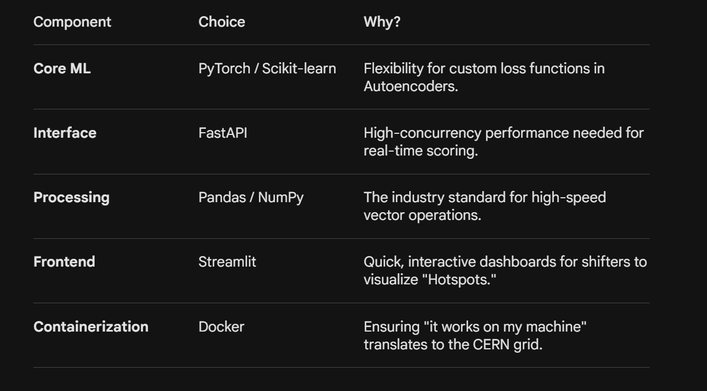

ML4DQM: Implementing Agentic AI for Real-Time Data Quality Monitoring
Author: Adarsh Bind

# 1. The Reality of DQM in High Energy Physics

In High Energy Physics (HEP), we aren't just dealing with "big data"—we’re dealing with high-velocity streams where even a few minutes of detector malfunction can lead to terabytes of unusable or "garbage" data. Currently, the CMS Data Quality Monitoring (DQM) workflow relies heavily on "shifters"—human operators who manually inspect histograms to spot anomalies.

The pain points are clear:

The Fatigue Factor: Human monitors can miss subtle drifts in detector performance during long shifts.

Volume: The sheer scale of streaming data from the LHC makes 100% manual coverage nearly impossible.

Latency: By the time a human notices a dip in occupancy or a noisy cold crystal, valuable beam time may have already been wasted.

We need a system that doesn't just display data, but understands it.

# 2. The Vision: An Agentic Pipeline

I’m proposing ML4DQM, an agentic AI layer designed to sit directly within the CMS DQM workflow. Instead of a passive dashboard, this is an active monitor that:

 Observes: Ingests live streams (or simulated equivalents for testing).

 Evaluates: Uses Unsupervised Learning (Autoencoders/Isolation Forests) to flag deviations from the "Golden" reference runs.

 Acts: Instead of just throwing an error, it provides context—ranking the severity of the anomaly to help physicists prioritize their intervention.

3. Under the Hood: System Architecture

The goal isn't just to build a model, but a reproducible pipeline.

Ingestion: Bridging the gap between CMS detector streams and Python-based ML environments.

Feature Engineering: Moving beyond raw hits to statistical features (mean, RMS, kurtosis) and domain-specific histograms.

The Model Layer: * Autoencoders: To learn the "latent representation" of healthy detector data.

Isolation Forests: For rapid, low-latency outlier detection.

Inference & Feedback: A FastAPI-backed engine that scores data in real-time.

# 4. Project Roadmap & Tech Stack
I've structured the project to be modular, ensuring that the ML logic is decoupled from the deployment infrastructure.

5. Deployment Strategy (The "Folder" Logic)

A clean project is a maintainable project. The ml4dqm_proposal/ directory is split into clear domains: ml/ for the "brains," pipelines/ for the "pipes," and monitoring/ for the "alerts." This separation ensures that a researcher can update the model without breaking the data ingestion logic.

6. Closing Thoughts

ML4DQM isn't about replacing the physicist; it’s about giving them a "digital twin" that never sleeps. By automating the first line of defense in anomaly detection, we ensure that the data collected at the frontier of physics is as reliable as the theories we’re trying to prove.

The Prototype: I have already developed a minimal FastAPI-based service. It includes a /predict endpoint that generates anomaly scores on the fly—proving that real-time ML inference in the DQM loop is not just possible, but practical.