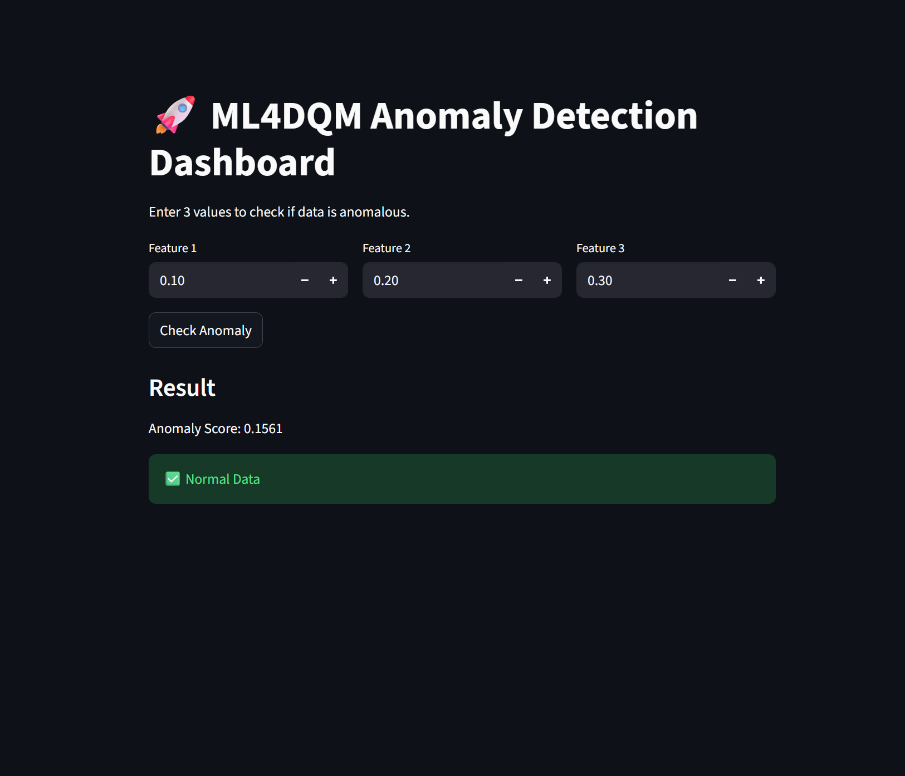

## Prototype: Anomaly Detection API

This prototype demonstrates a simple ML-based anomaly detection system using FastAPI.

### Features:
- Isolation Forest model
- Real-time inference API
- Returns anomaly score and flag

### Dashboard

Run:

streamlit run dashboard.py

This provides a simple UI to interact with the anomaly detection API.

## Dashboard Demo

### Run:

uvicorn api:app --reload

### Endpoint:
POST /predict

Example input:
[0.1, -0.2, 0.3]